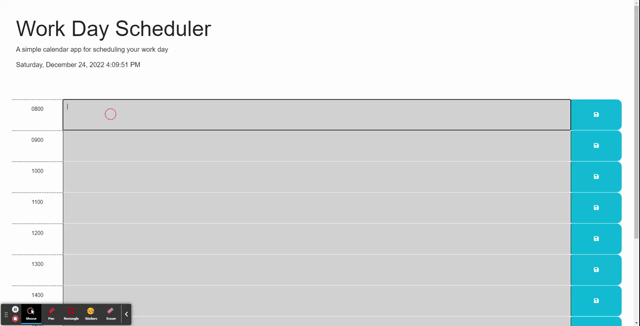

# Day Scheduler
## Description

This application has been designed to allow the user to keep a schedule that stores information in the local storage of the browser.

    - The application reacts to shifts in time to create a visual aide for the user, to easier pinpoint the current tasks scheduled to be completed.
    - This application keeps all information stored within the browsers local storage for the user to keep privately.

## Installation

This application is currently running at: https://garrettchaney.github.io/day-scheduler/

## Usage

Upon loading the webpage, begin to enter notes or tasks you wish to keep organized throughout your day, remembering to save each hour block in order to not lose them.
 
As the hours progress, the colors of the time blocks will change:
    - past: grey
    - present: red
    - future: green

## License
See attached license.

## Mockup Image

